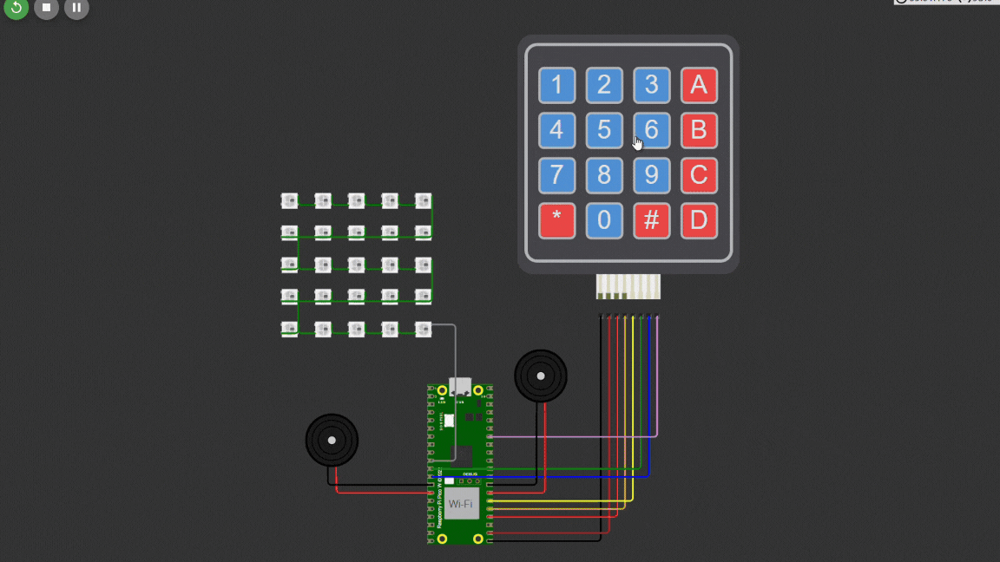

<div align="center">
    
</div>

<br>

# Animações em LEDs com Raspberry Pi Pico W

## Sumário

- [Descrição](#descrição)
- [Funcionalidades Implementadas](#funcionalidades-implementadas)
  - [1. Controle de animações na matriz de LEDs RGB 5x5](#1-controle-de-animações-na-matriz-de-leds-rgb-5x5)
  - [2. Controle de estados dos LEDs com letras e #](#2-controle-de-estados-dos-leds-com-letras-e-)
  - [3. Modo de Reboot](#3-modo-de-reboot)
- [Ferramentas utilizadas](#ferramentas-utilizadas)
- [Objetivos](#objetivos)
- [Instruções de uso](#instruções-de-uso)
- [Testes](#testes)
  - [1. Animação tecla 0](#1-animação-tecla-0)
  - [2. Animação tecla 1](#2-animação-tecla-1)
  - [3. Animação tecla 2](#3-animação-tecla-2)
  - [4. Animação tecla 3](#4-animação-tecla-3)
  - [5. Animação tecla 4](#5-animação-tecla-4)
  - [6. Animação tecla 5](#6-animação-tecla-5)
  - [7. Animação tecla 6](#7-animação-tecla-6)
  - [8. Animação tecla 7](#8-animação-tecla-7)
  - [9. Animação tecla 8](#9-animação-tecla-8)
  - [10. Animação tecla 9](#10-animação-tecla-9)
  - [11. Animação tecla A](#11-animação-tecla-a)
  - [12. Animação tecla B](#12-animação-tecla-b)
  - [13. Animação tecla C](#13-animação-tecla-c)
  - [14. Animação tecla D](#14-animação-tecla-d)
  - [15. Animação tecla #](#15-animação-tecla-)
- [Vídeo de apresentação](#vídeo-de-apresentação)
- [Formação da Equipe Subgrupo 06](#formação-da-equipe-subgrupo-06)
- [Licensa](#licença)

## Descrição

Este projeto implementa um sistema interativo utilizando o simulador de eletrônica **Wokwi**, o microcontrolador **Raspberry Pi Pico W**, e uma matriz de LEDs RGB 5x5 WS2812. O objetivo principal é gerar animações visuais controladas por um teclado matricial 4x4.

## Funcionalidades Implementadas

1. Controle de animações na matriz de LEDs RGB 5x5:

   - **Teclas de 0 a 9**: Executam 10 animações distintas, cada uma com no mínimo 5 frames, configuradas para proporcionar fluidez e clareza.
   - As animações são personalizáveis, com diferentes padrões, cores (RGB) e níveis de luminosidade.

2. Controle de estados dos LEDs com letras e #:

   - **Tecla 'A'**: Desliga todos os LEDs.
   - **Tecla 'B'**: Liga todos os LEDs na cor azul com 100% de luminosidade.
   - **Tecla 'C'**: Liga todos os LEDs na cor vermelha com 80% de luminosidade.
   - **Tecla 'D'**: Liga todos os LEDs na cor verde com 50% de luminosidade.
   - **Tecla '#'**: Liga todos os LEDs na cor branca com 20% de luminosidade.

3. Modo de Reboot:
   - **Tecla '\*'**: Habilita o modo de gravação do microcontrolador (reboot via software).

## Ferramentas utilizadas

- **Simulador de eletrônica wokwi**: Ambiente utilizado para simular o hardware e validar o funcionamento do sistema.
- **Ferramenta educacional BitDogLab (versão 6.3)**: Placa de desenvolvimento utilizada para programar o microcontrolador.
- **Microcontrolador Raspberry Pi Pico W**: Responsável pelo controle da matriz de LEDs, teclado matricial e o buzzer.
- **Matriz de LEDs RGB 5x5**: Dispositivo principal para exibição de animações controladas pelo sistema.
- **Teclado matricial 4x4**: Permite a interação do usuário com o sistema para acionar animações.
- **Buzzer**: Utilizado para emitir sinais sonoros durante o funcionamento do sistema.
- **Visual Studio Code (VS Code)**: IDE utilizada para o desenvolvimento do código com integração ao Pico SDK.
- **Pico SDK**: Kit de desenvolvimento de software utilizado para programar o Raspberry Pi Pico W em linguagem C.
- **Computador pessoal** para envio de comandos via terminal.

## Objetivos

1. Criar animações dinâmicas em uma matriz de LEDs RGB 5x5 controladas por um teclado matricial 4x4.
2. Implementar diferentes padrões visuais associados às teclas numéricas e letras do teclado.
3. Permitir o controle individual e coletivo dos LEDs, ativando cores específicas (azul, vermelho, verde, branco) com diferentes intensidades de luminosidade.
4. Implementar um modo de reboot para reiniciar o sistema em modo de gravação.
5. Integrar um buzzer passivo emitindo sinais sonoros sincronizados com determinadas animações.

## Instruções de uso

1. **Clonar o Repositório**:

```bash
git clone https://github.com/ferreiiratech/embarcatech-subgrupo-06-u4-microcontroladores-atividade-3.git
```

   

2. **Compilar e Carregar o Código**:
   No VS Code, configure o ambiente e compile o projeto com os comandos:

```bash	
cmake -G Ninja ..
ninja
```

3. **Interação com o Sistema**:
   - Conecte a placa ao computador.
   - Clique em run usando a extensão do raspberry pi pico.
   - Utilize o teclado para acionar as animações e controlar os LEDs.

## Testes

Os teste no hardware podem ser visuakizados [aqui](https://drive.google.com/drive/folders/1zTyCrrJox7HOzcYzbgQ-HIrh06xPz3uL?usp=drive_link)

### **1. Animação tecla 0**

- **Descrição:** Ao precionar a tecla 0, é exibida uma animação que mostra vários leds piscando aleatóriamente com diversas cores.
- **Passos:**

  1. Ligue a placa.
  2. Pressione a tecla 0.

  **Teste no Software:**  
  

  **Teste no Hardware:**  
  

---

### **2. Animação tecla 1**

- **Descrição:** Ao precionar a tecla 1, é exibida uma animação em espiral que ao chegar no centro, retrocede com outra cor.
- **Passos:**

  1. Ligue a placa.
  2. Pressione a tecla 1.

  **Teste no Software:**  
  

  **Teste no Hardware:**  
  

---

### **3. Animação tecla 2**

- **Descrição:** Ao precionar a tecla 2, é exibida uma mensagem na matriz com as letras 'S O S' em vermelho.
- **Passos:**

  1. Ligue a placa.
  2. Pressione a tecla 2.

  **Teste no Software:**  
  

  **Teste no Hardware:**  
  

---

### **4. Animação tecla 3**

- **Descrição:** Ao precionar a tecla 3, é exibida uma animação de linhas roxas que sobem.
- **Passos:**

  1. Ligue a placa.
  2. Pressione a tecla 3.

  **Teste no Software:**  
  

  **Teste no Hardware:**  
  

---


### **5. Animação tecla 4**

- **Descrição:** Ao precionar a tecla 4, é exibida uma animação de em linhas que avança e retrocede, mudando de cor a cada ciclo.
- **Passos:**

  1. Ligue a placa.
  2. Pressione a tecla 4.

  **Teste no Software:**  
  

  **Teste no Hardware:**  
  

---


### **6. Animação tecla 5**

- **Descrição:** Ao precionar a tecla 5, é exibida uma animação de um quadrado que altera de tamanho em direção ao centro.
- **Passos:**

  1. Ligue a placa.
  2. Pressione a tecla 5.

  **Teste no Software:**  
  

  **Teste no Hardware:**  
  

---


### **7. Animação tecla 6**

- **Descrição:** Ao precionar a tecla 6, é exibida uma animação de um coração.
- **Passos:**

  1. Ligue a placa.
  2. Pressione a tecla 6.

  **Teste no Software:**  
  

  **Teste no Hardware:**  
  

---


### **8. Animação tecla 7**

- **Descrição:** Ao precionar a tecla 7, é exibida uma animação com o nome CEPEDI.
- **Passos:**

  1. Ligue a placa.
  2. Pressione a tecla 7.

  **Teste no Software:**  
  

  **Teste no Hardware:**  
  

---


### **9. Animação tecla 8**

- **Descrição:** Ao precionar a tecla 8, é exibida uma animação de um relógio.
- **Passos:**

  1. Ligue a placa.
  2. Pressione a tecla 8.

  **Teste no Software:**  
  

  **Teste no Hardware:**  
  

---


### **10. Animação tecla 9**

- **Descrição:** Ao precionar a tecla 9, é exibida uma animação de uma contagem regressiva.
- **Passos:**

  1. Ligue a placa.
  2. Pressione a tecla 9.

  **Teste no Software:**  
  

  **Teste no Hardware:**  
  

---


### **11. Animação tecla A**

- **Descrição:** Ao precionar a tecla A, todos os leds da matriz se apagam.
- **Passos:**

  1. Ligue a placa.
  2. Pressione a tecla A.

  **Teste no Software:**  
  

  **Teste no Hardware:**  
  

---


### **12. Animação tecla B**

- **Descrição:** Ao precionar a tecla B, todos os leds da matriz acendem com a cor azul e 100% de luminosidade.
- **Passos:**

  1. Ligue a placa.
  2. Pressione a tecla B.

  **Teste no Software:**  
  

  **Teste no Hardware:**  
  

---


### **13. Animação tecla C**

- **Descrição:** Ao precionar a tecla C, todos os leds da matriz acendem com a cor vermelha e 80% de luminosidade.
- **Passos:**

  1. Ligue a placa.
  2. Pressione a tecla C.

  **Teste no Software:**  
  

  **Teste no Hardware:**  
  

---


### **14. Animação tecla D**

- **Descrição:** Ao precionar a tecla D, todos os leds da matriz acendem com a cor verde e 50% de luminosidade.
- **Passos:**

  1. Ligue a placa.
  2. Pressione a tecla D.

  **Teste no Software:**  
  

  **Teste no Hardware:**  
  

---


### **15. Animação tecla #**

- **Descrição:** Ao precionar a tecla #, todos os leds da matriz acendem com a cor branca e 20% de luminosidade.
- **Passos:**

  1. Ligue a placa.
  2. Pressione a tecla #.

  **Teste no Software:**  
  

  **Teste no Hardware:**  
  

---

### **15. Animação tecla '\*'**

- **Descrição:** Ao precionar a tecla *, a placa entra no modo bootloader.
- **Passos:**

  1. Ligue a placa.
  2. Pressione a tecla *.

  **Teste no Hardware:**  
  

---

## Vídeo de apresentação

O vídeo apresentando o projeto pode ser assistido [clicando aqui]().

## Formação da Equipe Subgrupo 06

<table>
  <tr>
    <td align="center">
      <a href="https://github.com/ferreiiratech">
        <br>
        <sub>
          <b>Leonardo Ferreira</b>
        </sub>
      </a>
    </td>
    <td align="center">
      <a href="https://github.com/yasmincsme">
        <br>
        <sub>
          <b>Yasmin Cordeiro</b>
        </sub>
      </a>
    </td>
    <td align="center">
      <a href="https://github.com/thalissoncastrog">
        <br>
        <sub>
          <b>Thalisson Castro</b>
        </sub>
      </a>
    </td>
    <td align="center">
      <a href="https://github.com/ArthurSaldanha01">
        <br>
        <sub>
          <b>Arthur Saldanha</b>
        </sub>
      </a>
  </tr>
  <tr>
    </td>
    <td align="center">
      <a href="https://github.com/bigodinhojf">
        <br>
        <sub>
          <b>João Felipe</b>
        </sub>
      </a>
    </td>
    </td>
        <td align="center">
      <a href="https://github.com/ateniltonjr">
        <br>
        <sub>
          <b>Atenilton Santos</b>
        </sub>
      </a>
    </td>
    </td>
        <td align="center">
      <a href="https://github.com/SamuelLopesH">
        <br>
        <sub>
          <b>Samuel Lopes</b>
        </sub>
      </a>
    </td>
    </td>
        <td align="center">
      <a href="https://github.com/nrocha46">
        <br>
        <sub>
          <b>Nicole Rocha</b>
        </sub>
      </a>
    </td>
  </tr>
</table>

## Licença

Este projeto está licenciado sob a licença MIT.
